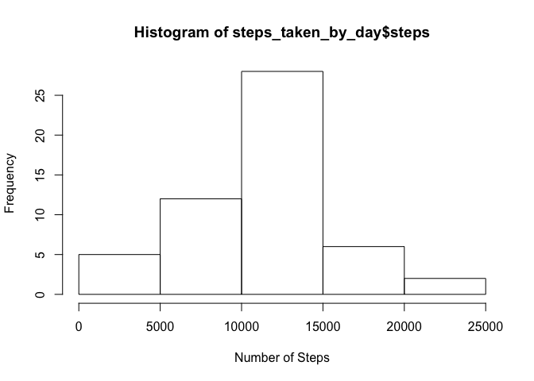
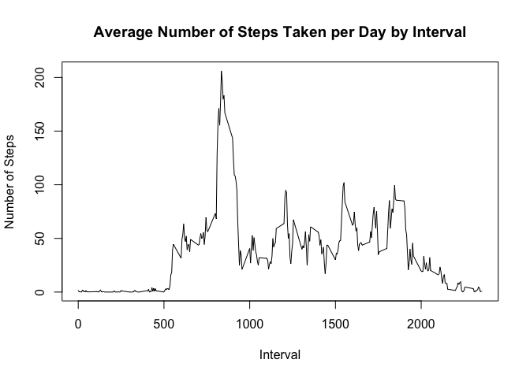
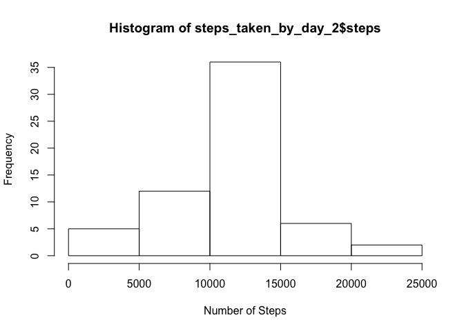
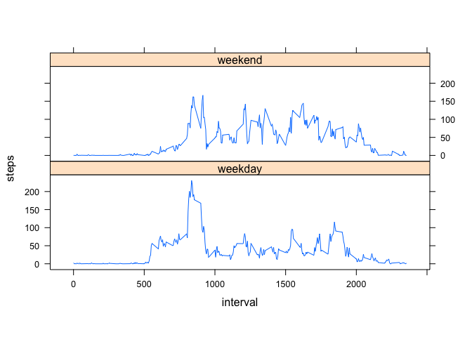

# Reproducible Research: Peer Assessment 1


## Loading and preprocessing the data

The Github repository comes with data. The data file is in the zipped file. For the first time (when we don't have the .csv file), the code unzip the file.

```r
if(!file.exists("activity.csv")) {
        unzip("activity.zip")
}

data <- read.csv("activity.csv")

head(data)
```

```
##   steps       date interval
## 1    NA 2012-10-01        0
## 2    NA 2012-10-01        5
## 3    NA 2012-10-01       10
## 4    NA 2012-10-01       15
## 5    NA 2012-10-01       20
## 6    NA 2012-10-01       25
```

The data has three columns including steps, date, and interval.


## What is mean total number of steps taken per day?


```r
steps_taken_by_day <- aggregate(steps ~ date, data, sum)
hist(steps_taken_by_day$steps, xlab="Number of Steps")
```

<!-- -->

```r
mean_value <- mean(steps_taken_by_day$steps)
median_value <- median(steps_taken_by_day$steps)
```

The mean and median of the total number of steps taken per day are 1.0766189\times 10^{4} and 10765, respectively.

## What is the average daily activity pattern?


```r
steps_taken_by_interval <- aggregate(steps ~ interval, data, mean)
head(steps_taken_by_interval)
```

```
##   interval     steps
## 1        0 1.7169811
## 2        5 0.3396226
## 3       10 0.1320755
## 4       15 0.1509434
## 5       20 0.0754717
## 6       25 2.0943396
```

```r
plot(steps_taken_by_interval$interval,steps_taken_by_interval$steps, type="l", xlab="Interval", ylab="Number of Steps",main="Average Number of Steps Taken per Day by Interval")
```

<!-- -->

```r
max_steps_interval <- steps_taken_by_interval[which.max(steps_taken_by_interval$steps),1]
```

On average the maximum number of steps happens in 835 interval. 

## Imputing missing values

First we need to calculate the total number of the missing values.


```r
sum_na_steps <- sum(is.na(data$steps))
sum_na_date <- sum(is.na(data$date))
sum_na_interval <- sum(is.na(data$interval))
```

Total number of missing values in the data set are 2304 and it only happens for number of steps.


```r
data2<- data
num_na<- is.na(data2$steps)
mean_interval<- tapply(data2$steps, data2$interval, mean, na.rm=TRUE, simplify = TRUE)
data2$steps[num_na] <- mean_interval[as.character(data2$interval[num_na])]
head(data2)
```

```
##       steps       date interval
## 1 1.7169811 2012-10-01        0
## 2 0.3396226 2012-10-01        5
## 3 0.1320755 2012-10-01       10
## 4 0.1509434 2012-10-01       15
## 5 0.0754717 2012-10-01       20
## 6 2.0943396 2012-10-01       25
```

Now we calculate the mentioned parameter for the new data.


```r
steps_taken_by_day_2 <- aggregate(steps ~ date, data2, sum)
hist(steps_taken_by_day_2$steps, xlab="Number of Steps")
```

<!-- -->

```r
mean_value_2 <- mean(steps_taken_by_day_2$steps)
median_value_2 <- median(steps_taken_by_day_2$steps)
```

The mean and median of the total number of steps taken per day in the filled in dataset are 1.0766189\times 10^{4} and 1.0766189\times 10^{4}, respectively.

In the new data set, the mean did not change, however, the median changed and became equal to mean. In the histogram data, we can see the effect imputing in the histogram data, there are more data close to the mean in comparison the original data.

## Are there differences in activity patterns between weekdays and weekends?

We need to add new column to data to represent the weekday or weekend day. To do that, first we need to recognize the day of the week.


```r
data2$date    <- as.Date(data2$date)
data2$day     <- weekdays(data2$date)
data2$daytype <- as.factor(ifelse(data2$day == "Saturday" | data2$day == "Sunday", "weekend", "weekday"))
head(data2)
```

```
##       steps       date interval    day daytype
## 1 1.7169811 2012-10-01        0 Monday weekday
## 2 0.3396226 2012-10-01        5 Monday weekday
## 3 0.1320755 2012-10-01       10 Monday weekday
## 4 0.1509434 2012-10-01       15 Monday weekday
## 5 0.0754717 2012-10-01       20 Monday weekday
## 6 2.0943396 2012-10-01       25 Monday weekday
```

Now we need to make a panel plot containing a time series plot of the 5-minute interval and the average number of steps taken.


```r
library(lattice)
data_lplot <- aggregate(steps ~ interval + daytype, data2, mean)
xyplot(steps ~ interval | factor(daytype), data_lplot, type="l", aspect=1/4)
```

<!-- -->

According to the plot during the weekday, there are more steps at the initial intervals than the weekends. Also we can see less activity in the middle of the day during the weekday. That is probably because of sitting during the weekday behind the computer or desk. 
